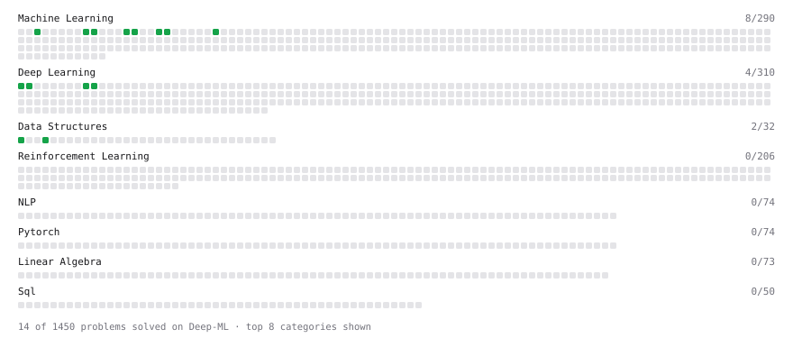

# Deep-ML

My machine learning practice from [Deep-ML](https://www.deep-ml.com). Every solution here was written by hand.

**5** solved · 5 problems · 0 labs · 0 math

[**Browse the interactive portfolio**](https://adi18-ui.github.io/deep-ml/) to replay this filling in over time.

## Problems

| | Difficulty | Solved | |
| --- | --- | --- | --- |
| [Batch Iterator for Dataset](https://www.deep-ml.com/problems/30) | easy | 2026-09-23 | [solution](problems/0030-batch-iterator-for-dataset) |
| [Feature Scaling Implementation](https://www.deep-ml.com/problems/16) | easy | 2026-09-21 | [solution](problems/0016-feature-scaling-implementation) |
| [Label Encoding for Ordinal Variables](https://www.deep-ml.com/problems/356) | easy | 2026-07-29 | [solution](problems/0356-label-encoding-for-ordinal-variables) |
| [Min-Max Scaling of Feature Values](https://www.deep-ml.com/problems/112) | easy | 2026-07-29 | [solution](problems/0112-min-max-scaling-of-feature-values) |
| [Random Shuffle of Dataset](https://www.deep-ml.com/problems/29) | easy | 2026-09-22 | [solution](problems/0029-random-shuffle-of-dataset) |

---

_This file is regenerated by Deep-ML on every push._
